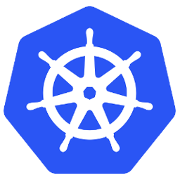

# **Docker Insights**


## References 
+ [Docker Overview](https://docs.docker.com/get-started/overview/)
+ [Install Docker Desktop on Windows](https://docs.docker.com/desktop/windows/install/)
+ [Install WSL](https://docs.microsoft.com/en-us/windows/wsl/install)

<br>
<br>
<br>
<br>
<br>

# Host Information [in my case it's Laptop]
## Windows Specs
+ Edition	Windows 10 Home
+ Version	21H1
+ OS build	19043.1466
+ Serial number	MP1NKND5
+ Experience	Windows Feature Experience Pack 120.2212.3920.0

<br>

## WSL 2 Backend (Windows Subsystem for linux Update v2)  <br>

>  <br>
> 
<br>

## Docker Desktop 
 <br>
<br>
> Additional Version Insights <br> <br>
>  <br>
> <br> 

<br>

### Docker Information <br><br>


<br>

# Docker Hub
 <br>
<br>
> 

<br>
<br>
<br>
<br>
<br>

# QUICK ILLUSTRATION OF DOCKER TUTORIAL EXAMPLE
## References
+ [Docker > Orientation and setup](https://docs.docker.com/get-started/)
+ [Docker Hub > Explore > docker/getting-started](https://hub.docker.com/r/docker/getting-started)

```
docker run -d -p 8080:80 --name docker-tutorial docker/getting-started
```
On successful execution of the above docker command, <br>
It should print "Container ID" in the last line, something like 76216cdc5d829f5c3efbbec1f6e2af55fc5df14bc7c3ef3f1a65ca4d01f86f60.

## Execution Snapshot & Walk Thro' <br>
> <br><br>
> Let's walk-thro these flags, options, args, etc.. <br>
>
> ```run``` <br>
> - it first creates a write-able container layer over the specified image, and then starts it using the specified command.
> - for more info, click [here](https://docs.docker.com/engine/reference/commandline/run/)
>
> ```-d``` <br>
> - runs the container in detached mode (in the background)
> - for more info, click [here](https://docs.docker.com/engine/reference/run/#detached--d)
>
> ```--name docker-tutorial``` <br>
> - name of the container
>
> ```-p 8080:80``` <br>
> - map port 8080 of the host to port 80 in the container
>
> ```docker/getting-started``` <br>
> - the image to use
> <br>

<br>

## Docker Dashboard <br>
## One should be able to see the above ``[run]`` container in here, as seen below :) <br> 
> <br> <br>
> ## &nbsp; &nbsp; Furthermore on clicking option 'Open in Browser', one should be navigated as seen below ...
>>  <br> <br>

<br>
<br>
<br>
<br>
<br>

# USAGE & ILLUSTRATION OF BASIC DOCKER COMMANDS
## References
+ [Docker CLI - Base Commands](https://docs.docker.com/engine/reference/commandline/docker/)

<br><br>

# **[pull]**
<br><br>

```
docker pull hello-world:latest
```
## Execution Snapshot <br>
> 

<br><br>

# **[build] & [run]**

# Firstly, Let's see how one can **[build]** an Image using 'Dockerfile'.
 <br>
### In order to build image, we need an simple text file strictly named as "Dockerfile". <br>
### let's say this Dockerfile holds below lines .. <br>
+ FROM alpine <br>
+ CMD ["/bin/sh", "-c", "echo '...hello from alpine container, It works!'"] <br>
<br>

```
docker build -t image-hellofromalpine:tag-v1.0 hello-from-alpine/
```

### On successful execution of the above docker command, <br>
### It should print in the last line, something like  => => naming to docker.io/library/hello-from-alpine:1.0. <br> <br>

## Execution Snapshot & Walk Thro' <br>
> 
> <br> <br>
> Let's walk-thro these flags, options, args, etc.. <br>
>
> ```build``` <br>
> - Build an image from a Dockerfile
> - for more info, click [here](https://docs.docker.com/engine/reference/commandline/build/)
>
> ```-t image-hellofromalpine:tag-v1.0 hello-from-alpine/```<br>
> - Name and optionally a tag in the 'name:tag' format 
> - Location of Docker File, in this case it's ```hello-from-alpine``` folder residing within project folder 'docker-insights' 
> <br>

<br> <br>
# Now let's create & start a Container for the above built Image [```image-hellofromalpine:tag-v1.0```] using **[run]** command. 


```
docker run --name container-hellofromalpine image-hellofromalpine:tag-v1.0
```

### On successful execution of the above docker command, <br>
### It should print something like &nbsp; &nbsp; &nbsp; &nbsp; ......hello from alpine container, It works!

<br>

## Execution Snapshot & Walk Thro' <br>
> 
> <br> <br>
> Let's walk-thro these flags, options, args, etc.. <br>
>
> ```run``` <br>
> - it first creates a write-able container layer over the specified image, and then starts it using the specified command.
> - for more info, click [here](https://docs.docker.com/engine/reference/commandline/run/)
>
> ```--name container-hellofromalpine``` <br>
> - name of the container
>
> ```image-hellofromalpine:tag-v1.0```<br>
> - the image to use
> <br>

<br> <br>


# Let's see how one can **[build]** an Image using on-the-fly 'Dockerfile'.
 <br>
```
docker build -t image-hellofromalpine-fly:tag-v1.0 - << EOF
FROM alpine:latest
CMD ["/bin/sh", "-c", "echo '...hello from alpine container (build by on-the-fly Dockerfile), It works!'"]
EOF
```

### On successful execution of the above docker command, <br> 
### It should print in the last line, something like  => => naming to docker.io/library/image-hellofromalpine-fly:tag-v1.0. <br><br>

## Execution Snapshot & Walk Thro' <br>
> 
> <br> <br>
> Let's walk-thro these flags, options, args, etc.. <br>
>
> ```build``` <br>
> - Build an image from a Dockerfile
> - for more info, click [here](https://docs.docker.com/engine/reference/commandline/build/)
>
> ```-t image-hellofromalpine-fly:tag-v1.0```<br>
> - Name and optionally a tag in the 'name:tag' format 
>
> ```- << EOF``` <br>
```FROM alpine:latest ``` <br>
```CMD ["/bin/sh", "-c", "echo '...hello from alpine container (build by on-the-fly Dockerfile), It works!'"]``` <br>
```EOF```
> - On the fly Dockerfile.

<br> <br>
# Now let's create & start a Container for the above built Image [```image-hellofromalpine-fly:tag-v1.0```] using **[run]** command. 


```
docker run --name container-hellofromalpine-fly image-hellofromalpine-fly:tag-v1.0
```

### On successful execution of the above docker command, <br>
### It should print ......hello from alpine container (build by on-the-fly Dockerfile), It works! <br><br>

## Execution Snapshot <br>
>  <br><br>

<br>

<hr>

#### Few other command w.r.t Images & Container.
+ docker image ls 
+ docker image inspect <ImageName:Tag>
+ docker rmi <ImageName:Tag>
+ docker container ls
+ docker container inspect <ContainerName|ContainerID>
+ docker stop <ContainerName|ContainerID>
+ docker rm <ContainerName|ContainerID>

<br><br>


# **[network], [volume] & [compose]**

<br>
<br>
<br>
<br>
<br>


# **Dockerized JavaScript App with Mongo DB**  

## Localised Run <br> <br>

 
# **[network]** 

<br><br>

# Let's create an network for Mongo using **[network]** command. <br>
<br><br>

```
docker network create network-Mongo 
```

### On successful execution of the above docker command, <br>
### It should print "Network-Id" something like &nbsp; &nbsp; 1e67b0b667bad88dc28efb7a81de3347b1aef4f4e23feeb02bbe856f473c597c

<br>

## Execution Snapshot & Walk Thro' <br>
> 


<br> <br>
# Now let's create & start a Container for the Image [```mongo```] using **[run]** command. 

 <br><br>

```
docker run \
-d \
-p 27017:27017 \
-e MONGO_INITDB_ROOT_USERNAME=admin \
-e MONGO_INITDB_ROOT_PASSWORD=password \
--name mongodb \
--net network-Mongo \
mongo
```

### On successful execution of the above docker command, <br>
### It should print "Container ID" in the last line, something like 76216cdc5d829f5c3efbbec1f6e2af55fc5df14bc7c3ef3f1a65ca4d01f86f60.

<br>

## Execution Snapshot & Walk Thro' <br>
> 
> <br> <br>
> Let's walk-thro these flags, options, args, etc.. <br>
>
> ```run``` <br>
> - it first creates a write-able container layer over the specified image, and then starts it using the specified command.
> - for more info, click [here](https://docs.docker.com/engine/reference/commandline/run/)
>
> ```-d``` <br>
> - detached mode
>
> ```-p 27017:27017``` <br>
> - port mapping
>
> ```-e MONGO_INITDB_ROOT_USERNAME=admin -e MONGO_INITDB_ROOT_PASSWORD=password``` <br>
> - environment variables
>
> ```--name mongodb``` <br>
> - name of the container
>
> ```--net network-Mongo``` <br>
> - name of the network
>
> ```mongo```<br>
> - the image to use
> <br>

<br> <br>

# Now let's create & start a Container for the Image [```mongo-express```] using **[run]** command. 

 <br><br>

```
docker run \
-d \
-p 8081:8081 \
-e ME_CONFIG_MONGODB_SERVER=mongodb \
-e ME_CONFIG_MONGODB_ADMINUSERNAME=admin \
-e ME_CONFIG_MONGODB_ADMINPASSWORD=password \
--name mongo-express \
--net network-Mongo \
mongo-express
```

### On successful execution of the above docker command, <br>
### It should print "Container ID" in the last line, something like aa2430c1bd89da51e80252a2a6c5ab1eac182c94f803dc0e825cbc3251b6fe96.

<br>

## Execution Snapshot & Walk Thro' <br>
> 

<br> <br>

        
### NOTES: <br>
#### Creating docker-network in optional. <br>
#### You can start both containers in a default network. In this case, just emit `--net` flag in **[run]** command. <br>

<br> <br>

# Now open mongo-express by navigating to http://localhost:8081
 <br>

## Before we proceed, kindly ... 
### + Create Database > `my-db`. 
### + Create Collection > `users` within `my-db` Database.

<br> <br>

# Go to app folder & start js-app locally ...

```
npm install 
node server.js
```

## Execution Snapshot <br>
> 

<br> <br>

# Access js-app UI by navigating to http://localhost:1000
 <br>

## Follow the below steps ...
## - Click on `My Profile` & update the profile accordingly.
## - Now the updated profile should refect in Mongo DB, one can verify it via Mongo-Express UI.
 <br>

<br> <br>


# Now lets try to **[build]** this js-app to docker image.
 <br>

## `Dockerfile` 
```
FROM node:13-alpine

ENV MONGO_DB_USERNAME=admin \
    MONGO_DB_PWD=password

RUN mkdir -p /home/app

COPY ./app /home/app

WORKDIR /home/app

CMD ["node", "/home/app/server.js"]
```

<br>

```
docker build -t js-app:1.0 dockerized-js-app
```
## Execution Snapshot <br>
> 

<br> <br>

# Now, ***[run]*** the above built image ''''''
 
 <br><br>

```
docker run -d \
-p 1000:1000 \
--name=container-js-app \
--net network-Mongo \
js-app:1.0
```

## Execution Snapshot<br>
> 

<br> <br>

<br>
<br>
<br>
<br>


# **[tag]**
<br><br>

```
docker tag js-app:1.0 ritesh87/dockerized-js-app:3.0
```
## Execution Snapshot <br>
> 

<br> <br>

# **[push]**
<br><br>

```
docker push ritesh87/dockerized-js-app:3.0 
```
## Execution Snapshot <br>
>  <br><br>
> 

<br> <br>

# Dockerized Run - with & without docker-compose


# **[volume]**
<br><br>

<br><br>

# **[compose]**
<br><br>


## docker-compose.yaml
```
version: '3'
services:
  dockerized-js-app:
    image: ritesh87/dockerized-js-app:2.0
    ports:
      - 1000:1000
  mongodb:
    image: mongo
    ports:
      - 27017:27017
    environment:
      - MONGO_INITDB_ROOT_USERNAME=admin
      - MONGO_INITDB_ROOT_PASSWORD=password
    volumes:
      - mongo-data:/data/db
  mongo-express:
    image: mongo-express
    restart: always # fixes MongoNetworkError when mongodb is not ready when mongo-express starts
    ports:
      - 8081:8081
    environment:
      - ME_CONFIG_MONGODB_ADMINUSERNAME=admin
      - ME_CONFIG_MONGODB_ADMINPASSWORD=password
      - ME_CONFIG_MONGODB_SERVER=mongodb
volumes:
  mongo-data:
    driver: local
```

```
docker-compose -f docker-compose.yaml up
```
## Execution Snapshot <br>
> 

<br> <br>


<br><br>

## References 
+ [Docker Samples](https://docs.docker.com/samples/)
+ [Docker - Dev Best Practices](https://docs.docker.com/develop/dev-best-practices/)
+ [Docker - Resources](https://docs.docker.com/get-started/resources/)
+ [Docker - ACI Integration](https://docs.docker.com/cloud/aci-integration/)


<br><br>

## References 
+ [xxxxxxxxx](https://x)
+ [xxxxxxxxx](https://x)

<br>
<br>
<br>
<br>
<br>

# Kubernetes


> Enable Single Node Cluster

> Alternatively, we have minikube :)

> Monitoring
>> Kubernetes Dashboard 
>> Prometheus - Grafana


<br><br>

## References 
+ [xxxxxxxxx](https://x)
+ [xxxxxxxxx](https://x)

<br>
<br>
<br>
<br>
<br>

# GitOps Principles


> [What is GitOps ?](https://about.gitlab.com/topics/gitops/)


<br><br>

## References 
+ [xxxxxxxxx](https://x)
+ [xxxxxxxxx](https://x)

<br>
<br>
<br>
<br>
<br>

# GitHub / GitLab / Azure Git


<br><br>

## References 
+ [xxxxxxxxx](https://x)
+ [xxxxxxxxx](https://x)

<br>
<br>
<br>
<br>
<br>

# ArgoCD Application


<br><br>

## References 
+ [xxxxxxxxx](https://x)
+ [xxxxxxxxx](https://x)


<br>
<br>
<br>
<br>
<br>

# jFrog Artifactory


<br><br>

## References 
+ [my jfrog url](https://riteshanvekar.jfrog.io/)
+ [xxxxxxxxx](https://x)


<br>
<br>
<br>
<br>
<br>


# Additional Subjects
[Java Debugging Intellij](https://training.play-with-docker.com/java-debugging-intellij/) 


